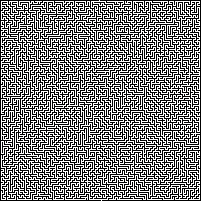
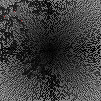

# MazeSolver
Using the Depth-First Search Algorithm to solve mazes from an input image, using Python.

## Input
Some example mazes are included in the images folder. The mazes have to follow the following rules:
- Each maze is black and white. White represents paths, black represents walls.
- The maze is surrounded entirely by black walls.
- One white square exists on the top row of the image, and is the start of the maze.
- One white square exists on the bottom row of the image, and is the end of the maze.


## Output
The output will be the image of the maze solved, with the path in red.

## Usage
```
python3 maze.py image.png
```

## Example
<div style="display:inline-block">
  
  
</div>
